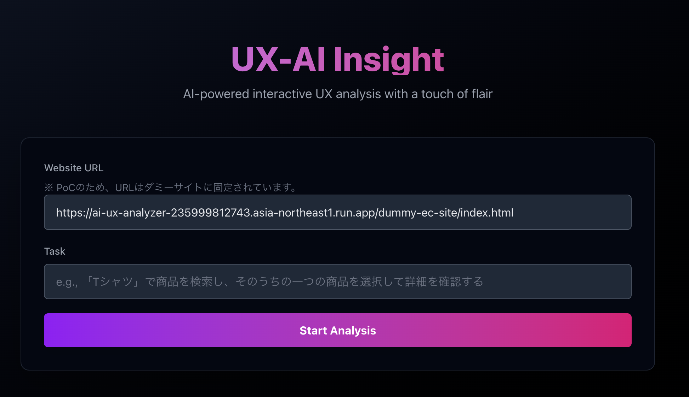

# UX-AI Insight

## 「AI があなたのウェブサイトの専属 UX コンサルタントになる」

これは、AI を活用してウェブサイトの UX（ユーザーエクスペリエンスを分析し、具体的な改善提案を行うためのツールです。



主な機能:

1.  自動 UX 分析: 指定された URL のウェブサイトを AI が分析し、ナビゲーション、フォームの使いやすさ、情報の見つけやすさ、アクセシビ
    リティの観点から改善点を提案します。
2.  インタラクティブなタスク分析: 「商品を検索して詳細を見る」といった具体的なタスクを AI がシミュレートします。その過程をステ
    ップごとに可視化し、各操作における UX の問題点を分析します。

技術的な特徴:

- Next.js（React フレームワーク）で構築された Web アプリケーションです。
- バックエンドでは、Google の Gemini API を利用して、ウェブサイトのコンテンツ分析や改善提案の生成を行っています。
- Playwright というツールを使って、実際のユーザー操作をシミュレートしています。

想定される利用者:

- ウェブサイトの改善を担当する UX デザイナーやプロダクトマネージャー
- 開発者やマーケターなど、ウェブサイトのパフォーマンスに関心のあるすべての人

## 開発

```bash
npm run dev
```

[.env](.env) を設定してください

[http://localhost:3000](http://localhost:3000)でアプリケーションを開くことができます。

---

Generated by Gemini CLI
